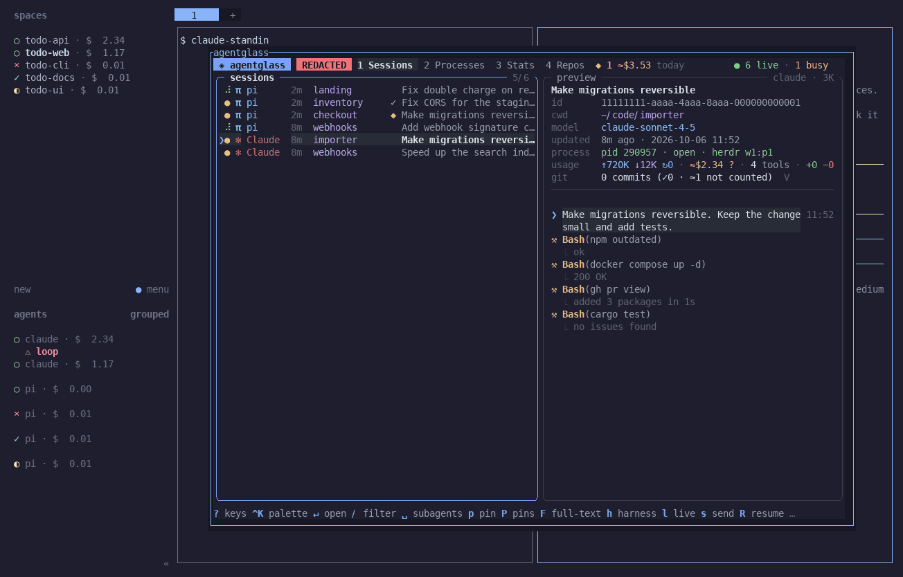
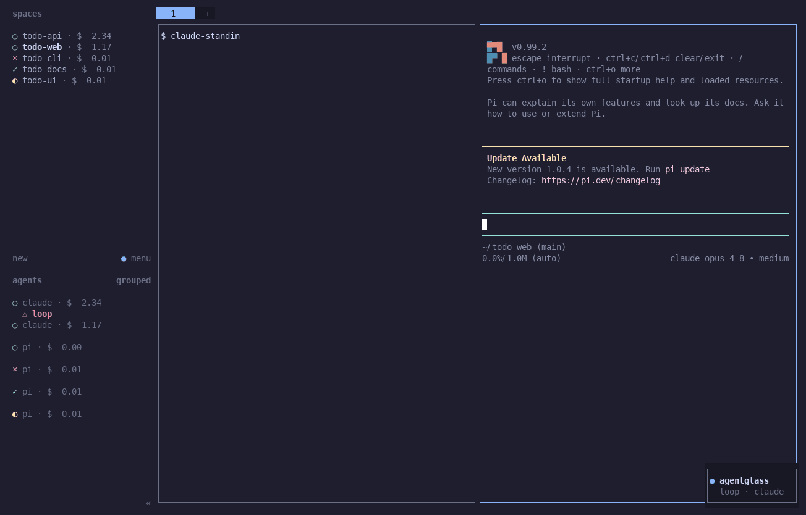
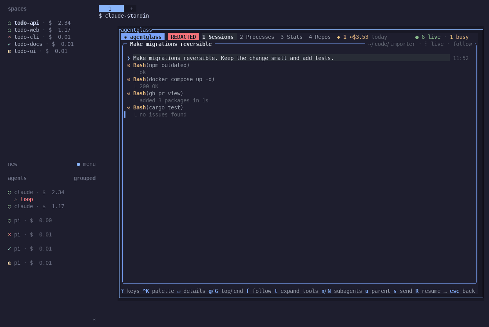
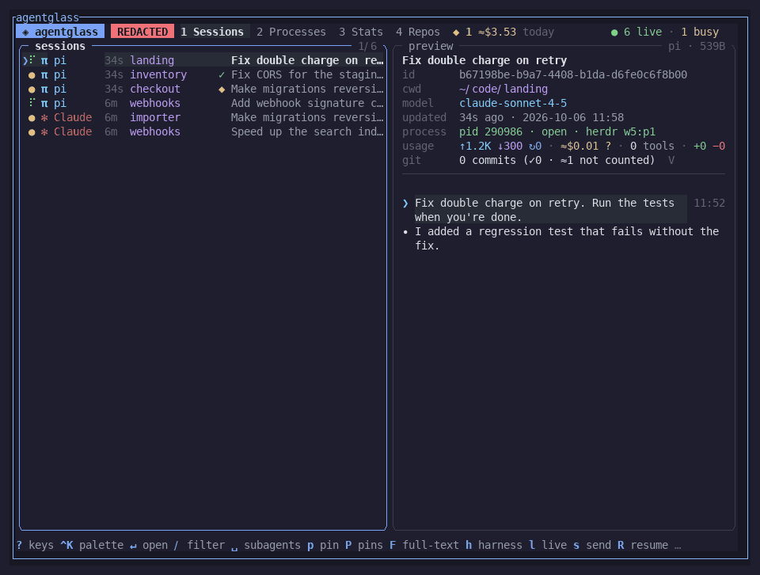
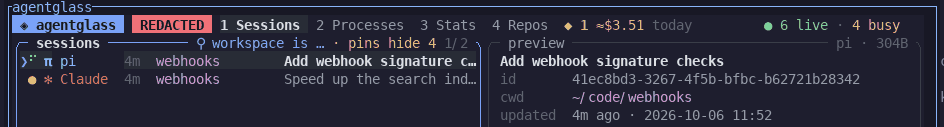
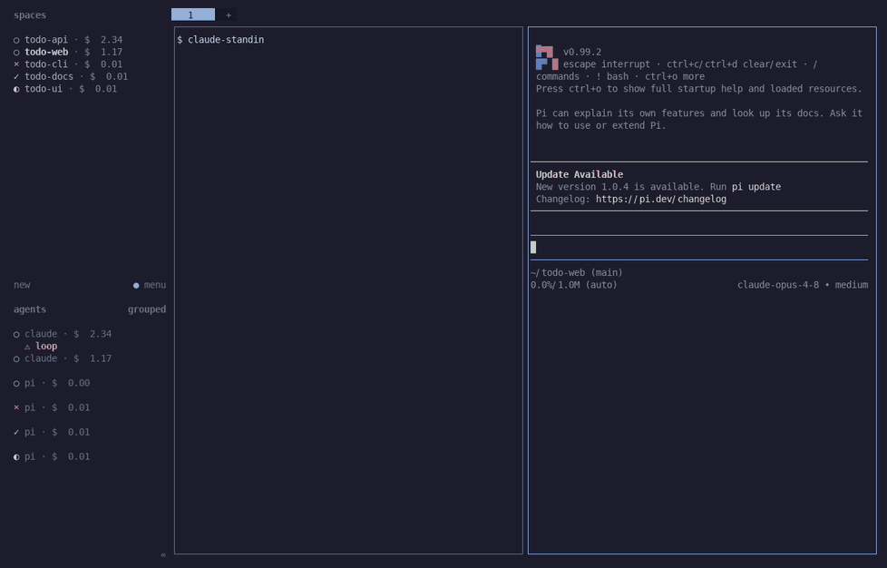

# agentglass for herdr

[agentglass](https://github.com/BjoernSchotte/agentglass) inside [herdr](https://herdr.dev). agentglass shows every
coding agent on your machine (sessions, tool calls, diffs, cost, alerts). This plugin brings it into the terminal
multiplexer where your agents run:

- **agentglass popup**: the full agentglass TUI, one key away, over whatever you are doing.
- **Open in agentglass**: the focused pane's agent session, opened in agentglass.
- **`agentglass://` links**: Ctrl-click a session link that agentglass prints (an OSC 8 hyperlink), and the session
  opens in the popup.
- **Workspace cost**: today's and the last 7 days' agent cost of the current workspace, as a herdr notification.
- **Sidebar tokens** (opt-in): `$ag_cost` and `$ag_alert` per agent, and `$ag_cost` per workspace, in herdr's sidebar.
  The values have a fixed width and are sent only when they change.
- **Notify recipe**: agentglass alerts that herdr cannot see (stalled, loop, long command, spinning, your own rules)
  show on the agent's pane, and critical ones become a herdr notification.


*The agentglass popup (`prefix+g`) over a herdr workspace with a Claude and a pi pane; the preview names the agent's herdr pane.*


*herdr's sidebar with the opt-in tokens: cost per agent and workspace (example values from fixture sessions), `⚠ loop` on the agent stuck in a loop, and the notify recipe's toast.*


*"Open in agentglass" (`prefix+G`) on the focused Claude pane lands on that agent's session.*


*herdr's state in agentglass's rows: spinner = working, `◆` = blocked at a dialog, `✓` = done and not seen yet.*


*"Sessions in this herdr workspace" (command palette) groups the sessions of one workspace (its label is hidden under `--redact`).*


*Popup → select a live agent → `R`: herdr focuses its pane and the popup closes.*

<sub>All shots: an isolated herdr 0.9.1 with throwaway todo-app agents (stand-ins and a real pi), agentglass in
`--redact` mode (fake titles and projects).</sub>

POSIX sh only: no Node, no jq, no build step. The plugin talks to agentglass only through its versioned
[CLI contract](https://github.com/BjoernSchotte/agentglass/blob/main/docs/cli-contract.md), and to herdr only through
herdr's documented CLI.

## Requirements

- herdr **0.7.5** or newer (plugin popups, startup hooks, sidebar tokens). Linux or macOS.
- agentglass **RELEASE-TAG** or newer: the first release with **CLI contract 1** (`agentglass --version --json` shows
  `"contract": 1`). Update with
  `agentglass update` or `brew upgrade agentglass`. If agentglass is too old, the popups say so; the hooks do nothing.

## Install

```sh
herdr plugin install BjoernSchotte/agentglass-herdr              # the default branch
herdr plugin install BjoernSchotte/agentglass-herdr --ref v0.1.0 # a pinned release
```

From a local checkout (development): `herdr plugin link /path/to/agentglass-herdr`.

The actions are in herdr's command palette and work from the CLI too:

| Action | What it does |
|---|---|
| `agentglass.tui` | the agentglass TUI in a popup |
| `agentglass.open-here` | the focused pane's agent session in agentglass (the session list when none is linked) |
| `agentglass.workspace-cost` | notification: this workspace's cost today and over 7 days |
| `agentglass.tokens-on` / `agentglass.tokens-off` | start / stop the sidebar tokens |

```sh
herdr plugin action invoke agentglass.tui
```

### Keys

The plugin binds no keys, so it cannot collide with your bindings. Add the bindings you want to herdr's
`config.toml`:

```toml
[[keys.command]]
key = "prefix+g"
type = "plugin_action"
command = "agentglass.tui"
description = "agentglass"

[[keys.command]]
key = "prefix+G"
type = "plugin_action"
command = "agentglass.open-here"
description = "open in agentglass"
```

In the popup, `R` on a live agent jumps to its herdr pane, and the popup closes. `q` closes the popup.

## Sidebar tokens

Turn them on once with `agentglass.tokens-on`. From then on the plugin updates them when an agent's state changes, and
when herdr starts. Turn them off with `agentglass.tokens-off`, which also clears every value the plugin set.

| Token | Where | Value |
|---|---|---|
| `$ag_cost` | agent rows | the session's cost: always 7 characters: `$  0.42`, `$ 12.40`, `$ 123.5`, `$  1.2k`; unpriced `$     ?` |
| `$ag_alert` | agent rows | always 10 columns: `⚠ stalled`, `⚠ loop`, `⚠ long-cmd`, `⚠ spinning`, `⚠ <your rule id>`; blank when no alert |
| `$ag_cost` | space rows | the sum over the workspace's agents |

Put them in your sidebar layout:

```toml
[ui.sidebar.agents]
rows = [
  ["state_icon", "agent", "$ag_cost"],
  [{ token = "$ag_alert", fg = "#f38ba8", bold = true }],
]

[ui.sidebar.spaces]
rows = [
  ["state_icon", "workspace", "$ag_cost"],
  ["branch", "git_status"],
]
```

**Why fixed width.** If a token changes width, herdr may lay out the sidebar again, and the panes flicker. Every
value keeps its width. A row without an alert is filled with U+2800 (a blank character that herdr does not trim), so
the row's width and the number of rows stay constant. To rule out a width change completely, pin the sidebar width:

```toml
[ui]
sidebar_min_width = 30
sidebar_max_width = 30
```

Each update is one `agentglass --json --live` run (about 0.5 s of CPU with a large history). Runs never overlap, and
they are paced: at most one per 10 seconds (`TOKENS_MIN_INTERVAL` in the config file). Events that arrive in between
cause one more run, not one per event, so a value can show up to 10 s late. Measured on herdr 0.9.1 with 30 status
changes a minute: the herdr server and the plugin used 2.3 % of a core with tokens on, 0.5 % with tokens off; idle,
there is no difference.

## Notify recipe (alerts herdr cannot see)

herdr already rings when an agent finishes or waits at a dialog. agentglass also sees other problems: an agent
stalled with no log activity, a loop of identical tool calls, a command running for 10 minutes, a busy CPU with a
silent log, and the rules you write yourself. `bin/ag-alert.sh` shows these on the agent's pane as `$ag_alert` for
10 minutes, and turns critical ones into a herdr notification (`loop · claude`). It never forwards `waiting` or
`approval`, so you do not get two bells for one dialog.

Alerts come from a running agentglass: the TUI while it is open, or a background `agentglass --watch --notify` (for
example started with your session: `agentglass --watch --notify > /dev/null &`). The popup alone runs only while it
is open.

1. Find the two paths:

   ```sh
   herdr plugin config-dir agentglass                 # the plugin's config dir
   herdr plugin list --plugin agentglass --json       # "plugin_root": where the plugin is installed
   ```

2. Add the notify command to `~/.agentglass/rules.json` (merge it with the `notify` you have):

   ```json
   {
     "notify": {
       "command": ["/bin/sh", "<plugin_root>/bin/ag-alert.sh", "<config dir>"],
       "on": ["fire", "escalate"]
     },
     "rules": [
       { "id": "loop", "notify": true },
       { "id": "long-cmd", "notify": true },
       { "id": "stalled", "notify": true },
       { "id": "spinning", "notify": true }
     ]
   }
   ```

   The built-in `loop`, `long-cmd`, `stalled` and `spinning` rules do not notify by default; `"notify": true` turns it
   on. agentglass runs a notify command only from a `rules.json` that only you can write: `chmod 600
   ~/.agentglass/rules.json`.

3. agentglass gives a notify command only a small environment. Tell the script where herdr is, in
   `<config dir>/config`:

   ```sh
   HERDR_SOCKET_PATH=/home/you/.config/herdr/herdr.sock   # only for a non-default server (herdr session)
   HERDR_BIN=/home/linuxbrew/.linuxbrew/bin/herdr         # only if herdr is not on PATH or in a usual place
   ```

4. herdr shows notifications only when toasts are on (they are off by default). In herdr's `config.toml`:

   ```toml
   [ui.toast]
   delivery = "herdr"     # or "terminal" / "system"
   ```

To stop agentglass's own approval and waiting bells for agents in herdr panes, because herdr's bell is enough, scope
the built-in rules in `rules.json`: `{"id": "waiting", "where": "mux is_not herdr"}`, and the same for `approval`.

## Configuration

`<config dir>/config` (from `herdr plugin config-dir agentglass`) holds `KEY=value` lines. The values are read as
text and never run.

| Key | Effect |
|---|---|
| `AGENTGLASS_BIN` | path to agentglass, when it is not on herdr's `PATH`, in `~/.local/bin` or in Homebrew's dirs |
| `AGENTGLASS_REDACT=1` | agentglass runs in redact mode in the popups; no cost goes to herdr (no `$ag_cost`); workspace notifications name the workspace by id |
| `HERDR_SOCKET_PATH` | the herdr server for the notify recipe (the popups and hooks get it from herdr) |
| `HERDR_BIN` | path to herdr for the notify recipe |
| `TOKENS_MIN_INTERVAL` | seconds between two sidebar-token runs (default 10; 0 = on every event) |

## Privacy

- herdr receives only **numbers and rule ids** (the tokens) and **rule and harness names** (notifications such as
  `loop · claude`), plus the workspace's own label in the workspace-cost notification (its id under redact).
- No session title, prompt, path, project name, command or alert message goes to herdr. The tests check this: the
  fixtures contain such text, and the tests assert it never appears in herdr's calls.
- `agentglass://` links are checked against `agentglass://open/[A-Za-z0-9._:%/#=&?-]+` twice (in the action and in the
  popup) before `agentglass open` receives them.

## Troubleshooting

- `herdr plugin log list --plugin agentglass`: each action, hook and popup run with its exit status and output.
- The plugin's own log is `plugin.log` in its state dir (`HERDR_PLUGIN_STATE_DIR`; on Linux
  `~/.local/state/herdr/plugins/agentglass/`). It records failed token updates, a missing or too old agentglass (once),
  and a stale run lock that was taken over.
- The popup says "CLI contract 1 needed": update agentglass.
- Ctrl-click on an `agentglass://` link does nothing: herdr recognizes plain-text links only for `http(s)://`. An
  `agentglass://` link must be an OSC 8 hyperlink, as agentglass prints its session ids when the terminal supports
  hyperlinks.
- `$ag_alert` shows boxes instead of blanks: your terminal has no font fallback for U+2800 (braille blank). Most
  terminals fall back to a font that has it (DejaVu Sans, Apple Braille); setting a fallback font fixes it.
- Open in agentglass shows the session list: agentglass has not linked that pane's agent to a session yet. Check
  `agentglass --json --live --fields id,mux_pane`.

## Development

```sh
sh test/run.sh                                 # every test under dash, bash, sh and bash --posix; fakes only
shellcheck -s sh bin/*.sh test/*.sh            # must be clean
AGENTGLASS_BIN=$(command -v agentglass) sh test/contract.sh   # a real agentglass against what the plugin uses
```

The tests never call a real herdr or agentglass. `test/fake-herdr.sh` records every call, and
`test/fake-agentglass.sh` answers CLI contract 1 from `test/fixtures/` and rejects any field outside it. CI runs the
tests on Linux and macOS, plus shellcheck and a TOML check of the manifest. The contract job (against the newest
agentglass release) is enabled once that release carries contract 1.

## Design notes

Each note: question · options · decision · why · cost if wrong.

1. **Language**: Node, a compiled binary, or POSIX sh · **POSIX sh, no jq**. The plugin is glue between two CLIs;
   `herdr plugin install` needs no toolchain. agentglass returns csv, so no JSON parser is needed. · Cost if wrong: a
   rewrite if the glue grows; the contract keeps that independent.
2. **What the plugin may call**: agentglass internals (files under `~/.agentglass`) or the versioned CLI contract ·
   **only the contract**, checked at runtime (`contract >= 1`) and in CI. `test/t_no_internals.sh` fails on any
   `.agentglass/` path in `bin/`. · Cost if wrong: one more document for agentglass to keep.
3. **How the target pane / clicked link reach the popup**: a state file or the popup's environment
   (`herdr plugin pane open --env`) · **environment**. No file is left behind when herdr refuses the popup (`ui_busy`),
   and two quick invocations cannot race. Checked on herdr 0.9.1: the popup process gets `AGH_TARGET`. · Cost if wrong:
   a herdr without `--env` for popups would show the session list instead.
4. **`--new-instance` in popups**: hand the link to an agentglass TUI running elsewhere, or open it here · **here**.
   The user looks at the popup. · Cost if wrong: two TUIs for a moment.
5. **Padding of `$ag_alert`**: spaces, NBSP, U+2800, or clearing the token · **U+2800**. herdr trims Unicode
   whitespace from token values, and an empty value clears the token. That would break the fixed width. Checked on
   herdr 0.9.1: `⚠ stalled ` is stored as `⚠ stalled`, three spaces clear the token, 10 × U+2800 stays; on screen
   the blank rows keep the sidebar's row count and width while values change (I1). Monospace fonts (DejaVu Sans
   Mono, JetBrains Mono) lack U+2800; terminals take it from a fallback font that draws it blank. · Cost if wrong: a
   terminal without font fallback shows boxes; the fallback is to clear the token.
6. **Rule ids in `$ag_alert`**: as written, or normalized · **lowercase `[a-z0-9_-]`, at most 8 characters**
   (`long cmd` → `long-cmd`). This keeps the fixed width, and no free text reaches herdr. · Cost if wrong: a long
   custom rule id shows cut.
7. **Workspace id for workspace tokens**: a new contract field, `herdr workspace list`, or the pane id's prefix ·
   **the prefix** (herdr's pane ids are `<workspace_id>:p<n>`). It needs no extra call, works under redact (where
   agentglass hides workspace labels), and needs no contract change. · Cost if wrong: if herdr's id scheme changes,
   the workspace sums fail (logged) and the pane tokens keep working.
8. **What a token report sends**: both tokens on every change, or only the changed one · **only the changed one**
   (herdr keeps the tokens a report does not name). · Cost if wrong: none.
9. **Agent left its pane**: keep its tokens or clear them · **clear** on the next run, so a shell pane does not show a
   stale cost.
10. **After herdr restarts** (pane metadata is gone): wait for changes, or report everything · **the startup hook
    forgets the last values and reports all**.
11. **Event bursts**: one run per event, or coalesce · **coalesce**: a `mkdir` lock, a `dirty` flag, at most 3 rounds,
    and a re-check after the unlock so no event is lost. A lock 120 s old (a crashed run) is taken over.
12. **Notify recipe scope**: forward all alerts, or only those herdr cannot see · **never `waiting`/`approval`; only
    `fire`/`escalate`**. herdr already rings for done and blocked, and duplicate bells teach users to ignore both. ·
    Cost if wrong: a user who wants both edits one line.
13. **Notify recipe config**: ask `herdr plugin config-dir` each time, or take it as an argument · **the argument**
    (from the README's `rules.json` line), with herdr as the fallback. agentglass strips the notify environment, so
    `HERDR_BIN` and `HERDR_SOCKET_PATH` come from the config file.
14. **Key bindings**: bind `prefix+g` in the manifest, or document them · **document them**, because a manifest binding
    can collide with your config. · Cost if wrong: one config block to copy.
15. **Token pacing**: a run per event, or at most one per interval · **one per 10 s** (`TOKENS_MIN_INTERVAL`). With
    many agents changing state, one agentglass run (≈ 0.5 s of CPU with a large history) per change adds up to a
    busy core; measured unpaced 0.19 s CPU per change with a small history. · Cost if wrong: values up to 10 s late.
16. **Lost events between a run's last check and its unlock**: a hook marks `dirty` *before* it tries the lock (and
    before the event hook's fast path looks at it), and the holder checks `dirty` after its unlock: either the hook
    gets the lock, or the holder sees `dirty`.
17. **The notify recipe and agentglass's herdr discovery**: agentglass strips the notify environment (no
    `HERDR_BIN_PATH`, often no herdr on `PATH`), so the `agentglass --json` the recipe runs could not see herdr panes.
    The recipe passes its herdr as contract 1's `AGENTGLASS_HERDR` (found in I1: the pi stalled alert reached no pane).

## License

Apache-2.0, like agentglass.
